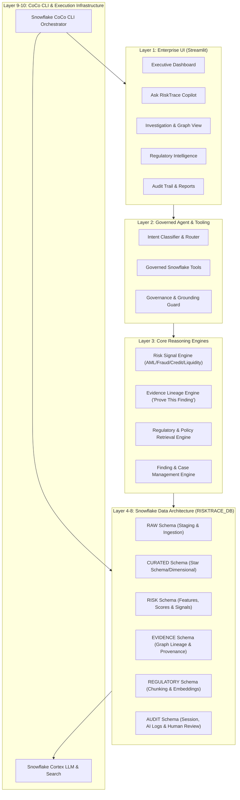

# RiskTrace Architecture Plan

**Project Name:** RiskTrace — Evidence-First Financial Risk Intelligence Copilot  
**Hackathon:** Snowflake CoCo CLI Hackathon 2026 — GCC Edition  
**Phase:** Phase A — Planning & Architecture  

---

## 📌 Executive Summary

RiskTrace is an enterprise-grade financial risk intelligence copilot engineered natively on Snowflake and built using Snowflake CoCo CLI. It bridges the gap between real-time risk signal detection, automated evidence collection, regulatory grounding, explainable finding creation, and human-in-the-loop audit reporting.

Unlike traditional conversational bots that hallucinate regulatory rules or summarize data without citations, RiskTrace strictly operates on the principle: **"NO CLAIM WITHOUT EVIDENCE."**

---

## 🏗️ 10-Layer System Architecture

---

## 📑 Detailed Architectural Layers

### Layer 1: Enterprise Interface (Streamlit in Snowflake / Native App)
- **Design System:** Professional light-mode banking layout, sans-serif typography, high information density.
- **Key Modules:**
  - Executive Risk Dashboard (Live KPIs, signal distribution, pending cases).
  - Ask RiskTrace (Natural-language search with citations and confidence metrics).
  - Deep Investigation & "PROVE THIS FINDING" interactive lineage visualizer.
  - Regulatory Search & Rule Verification explorer.
  - Audit Trail & Governance Log.

### Layer 2: Governed Agent & Tooling (Cortex Agent Framework)
- **Functionality:** Interprets user intent, executes strictly bounded Snowflake SQL/python tools, and synthesizes answers.
- **Safety Boundaries:** Read-only data access for queries; explicit auditable functions for case/finding generation; zero direct unparsed SQL execution by LLM.

### Layer 3: Risk Signal Engine (Deterministic + Statistical)
- **AML Module:** Velocity anomalies, smurfing/structuring, rapid pass-through, circular transfers, high-risk counterparty concentration.
- **Fraud Module:** Device/location anomalies, abrupt baseline deviation, dormant-to-active sudden surge.
- **Credit Module:** Repayment degradation, debt utilization spikes, inflow deterioration.
- **Liquidity Module:** Concentrated outflow spikes, liquidity buffer deterioration, intraday reserve stress.

### Layer 4: Regulatory & Document Intelligence Layer
- **Source Documents:** RBI Guidelines, FATF Standards, Basel III Framework, Internal AML/KYC policies.
- **Infrastructure:** Document chunking, Cortex Search Service / Vector Embeddings, strict citation enforcement.

### Layer 5: Evidence Engine & Trust Graph
- **Functionality:** Captures granular evidence records (`TRANSACTION`, `CALCULATION`, `POLICY`, `REGULATORY`) for every detected signal.
- **Lineage:** Links `Customer/Account` $\rightarrow$ `Risk Signal` $\rightarrow$ `Evidence` $\rightarrow$ `Policy/Regulation` $\rightarrow$ `Finding` $\rightarrow$ `Report`.

### Layer 6: Human-in-the-Loop & Audit Layer
- **Workflow:** Findings remain in `PENDING_REVIEW` until a compliance analyst clicks `CONFIRM`, `REJECT`, or `REQUEST_MORE_EVIDENCE`.
- **Immutable Audit:** Every prompt, tool execution, AI response, evidence reference, and human decision is immutably logged in `AUDIT.AUDIT_EVENT`.

---

## 🔒 Governance & Refusal Rules

1. **No Evidence, No Claim:** If factual evidence or calculation metrics do not exist in Snowflake, return `"Insufficient verified evidence."`
2. **No Regulatory Hallucination:** If no regulatory document match is found above the similarity threshold, explicitly return `"Insufficient verified regulatory evidence to support this claim."`
3. **Human Decides:** AI recommends and synthesizes; human compliance officers make final legal/regulatory determinations.
