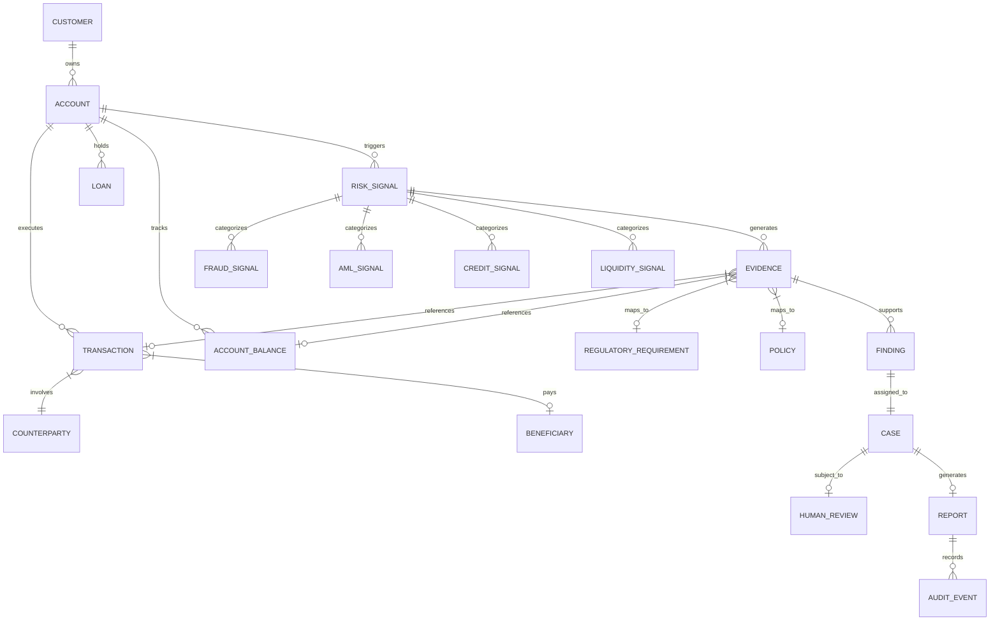

# RiskTrace Domain Ontology & Trust Graph

**Project Name:** RiskTrace — Evidence-First Financial Risk Intelligence Copilot  
**Hackathon:** Snowflake CoCo CLI Hackathon 2026 — GCC Edition  

---

## 🌐 Entity-Relationship Ontology

The RiskTrace domain model consists of 20 core entities organized into 4 functional domains: Core Banking, Risk Signals, Regulatory Knowledge, and Evidence/Governance.

---

## 📌 Entity Definitions

| Entity | Description | Key Identifier | Domain |
| :--- | :--- | :--- | :--- |
| **CUSTOMER** | Primary individual or corporate banking entity | `customer_id` | Core Banking |
| **ACCOUNT** | Financial account (Savings, Current, Credit) | `account_id` | Core Banking |
| **TRANSACTION** | Financial ledger entry (Credit/Debit/Transfer) | `transaction_id` | Core Banking |
| **COUNTERPARTY** | External or internal transaction destination/source | `counterparty_id` | Core Banking |
| **BENEFICIARY** | Registered recipient for fund transfers | `beneficiary_id` | Core Banking |
| **DEVICE** | Hardware/browser signature used during transaction | `device_id` | Core Banking |
| **LOCATION** | Geo-IP or physical location coordinates | `location_id` | Core Banking |
| **LOAN** | Credit facility / borrowing record | `loan_id` | Core Banking |
| **PAYMENT** | EMI or credit settlement transaction | `payment_id` | Core Banking |
| **ACCOUNT_BALANCE** | Daily/Intraday snapshot of account balance | `balance_id` | Core Banking |
| **RISK_SIGNAL** | Detected anomaly or rule violation signal | `signal_id` | Risk Intelligence |
| **FRAUD_SIGNAL** | Account takeover, velocity, or geolocation anomaly | `fraud_signal_id` | Risk Intelligence |
| **AML_SIGNAL** | Mule pattern, structuring, or circular movement | `aml_signal_id` | Risk Intelligence |
| **CREDIT_SIGNAL** | Repayment default or income deterioration signal | `credit_signal_id` | Risk Intelligence |
| **LIQUIDITY_SIGNAL** | Deposit outflow or buffer stress signal | `liquidity_signal_id` | Risk Intelligence |
| **EVIDENCE** | Verified factual artifact (SQL calculation/record) | `evidence_id` | Evidence Engine |
| **REGULATORY_DOCUMENT**| External statute (RBI, FATF, Basel III) | `document_id` | Regulatory Layer |
| **POLICY** | Internal bank policy or compliance standard | `policy_id` | Regulatory Layer |
| **FINDING** | Explainable synthesis of signals + evidence | `finding_id` | Governance |
| **CASE** | Investigation container assigned to an analyst | `case_id` | Governance |
| **HUMAN_REVIEW** | Compliance officer decision (Approve/Reject) | `review_id` | Governance |
| **REPORT** | Regulatory SAR/CTR or audit-ready PDF report | `report_id` | Audit & Reporting |
| **AUDIT_EVENT** | Immutable lineage log of AI & human steps | `audit_id` | Audit & Reporting |

---

## 🔗 Traceability & Evidence Lineage Chain

Every query or finding must be capable of rendering the full lineage chain:

$$\text{User Question} \rightarrow \text{Natural Language Intent} \rightarrow \text{Data Query} \rightarrow \text{Risk Signal} \rightarrow \text{Evidence Collection} \rightarrow \text{Policy Citation} \rightarrow \text{Finding} \rightarrow \text{Human Review} \rightarrow \text{Audit Report}$$
